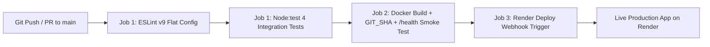

# Dr. Vishwanath Karad MIT World Peace University, Pune
### School of Computer Engineering and Technology
**Course:** Cloud Computing and DevOps (`CSE30040`) — Continuous Class Assessment 2 (CCA 2)  
**Faculty Mentor:** Prof. Pranati Waghodekar

---

## 📋 Student & Project Details

| Field | Details |
| :--- | :--- |
| **Student Name** | Kapil (`[ENTER FULL NAME]`) |
| **PRN** | `[ENTER PRN NUMBER]` |
| **Roll No. / Panel** | `[ENTER ROLL NO & PANEL]` |
| **Project Title** | ArenaOps — Sports Management System & Automated CI/CD Pipeline |
| **GitHub Repository URL** | [https://github.com/kapil2908/sports-manager-system-web.git](https://github.com/kapil2908/sports-manager-system-web.git) |
| **Live Render App URL** | `[PASTE_LIVE_RENDER_URL_HERE]` |
| **Submission Date** | September 28, 2026 |
| **Subject Faculty** | Prof. Pranati Waghodekar |

---

## 🏆 Project Overview

**ArenaOps (Sports Management System)** is a server-side rendered (SSR) dynamic web application engineered with **Node.js**, **Express**, and **EJS**, paired with an automated **GitHub Actions CI/CD Pipeline**, **Docker (`node:22-alpine`)** containerization, and zero-downtime webhook deployment to **Render**.

### ✨ Dynamic Features
1. **Live Arena Telemetry & Statistics Dashboard**: Real-time calculation of total tournament fixtures, match completion rate (`%`), active live games, average match intensity rating (`1–5`), and the active 7-character Git commit SHA (`GIT_SHA`).
2. **In-Memory Match Fixture Store with Reset Isolation**: Pre-seeded with MIT-WPU inter-department and university fixtures (`Football`, `Cricket`, `Basketball`, `Badminton`, `Athletics`, `Esports`) and exports `app.resetStore()` for deterministic test isolation.
3. **Server-Side Validated & XSS-Sanitized Fixture Registration (`POST /matches`)**:
   - Validates required fields (`title`, `category`, `status`, `rating`) and returns `HTTP 400` if missing.
   - Enforces strict allowlists on Sport Discipline (`category`) and Fixture Status (`status`).
   - Validates numeric intensity rating strictly within `1–5` range (`HTTP 400` if out of bounds).
   - Sanitizes all string inputs against Cross-Site Scripting (XSS) by escaping `&`, `<`, `>`, `"`, and `'`.
   - Content-negotiation aware: returns `HTTP 201` JSON when `Accept: application/json` is supplied, or redirects with flash query messages for browser form submissions.
4. **Fixture Deletion (`POST /matches/:id/delete`)**: Removes completed or cancelled fixtures dynamically.
5. **REST Telemetry API (`GET /api/matches`) & Health Check (`GET /health`)**: Exposes full JSON fixture list, live numeric statistics, container uptime, ISO timestamp, and active build commit SHA.

---

## 🔄 CI/CD Pipeline Architecture



---

## 🚀 Quick Start Guide

### Prerequisites
- **Node.js** `>= 22.x` and **npm** `>= 10.x`
- **Docker** (optional, for local container verification)
- **Git** & **Python 3** (for commit history automation and PDF report generation)

### Local Installation & Verification

```bash
# 1. Install dependencies
npm install

# 2. Run ESLint v9 code quality check
npm run lint

# 3. Run the 4 built-in node:test integration tests
npm test

# 4. Start the Express + EJS server on http://localhost:3000
npm start
```

---

## 🐳 Docker Containerization

Build and test the production `node:22-alpine` container locally with an injected Git commit SHA:

```bash
# 1. Build the Docker image with GIT_SHA build argument
docker build --build-arg GIT_SHA=$(git rev-parse --short HEAD) -t sports-manager-system-web .

# 2. Run the container in detached mode on port 3000
docker run -d -p 3000:3000 --name sports-manager-system-web sports-manager-system-web

# 3. Smoke-test the container health endpoint
curl -f http://localhost:3000/health

# 4. Stop and remove the test container
docker stop sports-manager-system-web && docker rm sports-manager-system-web
```

---

## ☁️ Render Cloud Deployment Steps

1. Sign in to [Render.com](https://render.com) using your GitHub account (`kapil2908`).
2. Click **New +** → **Web Service** and connect your repository `sports-manager-system-web`.
3. Configure the service using the exact settings below:

| Setting | Value |
| :--- | :--- |
| **Runtime / Language** | `Node` (or `Docker`) |
| **Branch** | `main` |
| **Root Directory** | *(leave blank)* |
| **Build Command** | `npm ci` |
| **Start Command** | `node server.js` |
| **Instance Type** | `Free` |
| **Health Check Path** | `/health` |
| **Auto-Deploy** | `Off` *(Crucial: GitHub Actions controls deployment after tests pass)* |

4. **Configure GitHub Secret (`RENDER_DEPLOY_HOOK`)**:
   - In your Render Web Service dashboard, go to **Settings** → **Deploy Hook** and copy the webhook URL.
   - In your GitHub repository, navigate to **Settings** → **Secrets and variables** → **Actions** → **New repository secret**.
   - Name: `RENDER_DEPLOY_HOOK`
   - Value: Paste your Render Deploy Hook URL and save.

---

## 🎓 Viva Voce Questions & Answers

### 1. What is the difference between Continuous Integration (CI) and Continuous Deployment (CD)?
**Answer:**  
**Continuous Integration (CI)** is the automated practice where developers frequently merge code changes into a shared branch (`main`), triggering automated linting (`eslint`) and unit/integration testing (`node --test`) to catch defects early. **Continuous Deployment (CD)** extends CI by automatically packaging the verified code (into a Docker image, smoke-testing `/health`) and releasing every build that passes all automated quality gates directly into the live production environment (Render) without manual intervention.

### 2. What does the `needs:` keyword do in a GitHub Actions workflow?
**Answer:**  
By default, jobs in a GitHub Actions workflow execute in parallel. The `needs:` keyword defines a strict sequential dependency graph between jobs (`build` has `needs: test`, and `deploy` has `needs: build`). If an upstream job fails—for example, if a unit test or ESLint rule fails in `test`—GitHub Actions immediately halts the pipeline and skips `build` and `deploy`, preventing broken code from ever reaching production.

### 3. Why must we store the Render Deploy Hook URL inside GitHub Secrets (`secrets.RENDER_DEPLOY_HOOK`) instead of hardcoding it in `ci-cd.yml`?
**Answer:**  
A Render Deploy Hook URL contains an embedded cryptographic authentication token that grants anyone possessing the URL the ability to trigger arbitrary production deployments or cause denial-of-service via repeated rebuilds. Storing it in **GitHub Encrypted Secrets** ensures the URL is encrypted at rest, never exposed in public repository source code, and automatically redacted (`***`) in all GitHub Actions build logs.

### 4. Why do we containerize the application with Docker (`node:22-alpine`) in our CI/CD pipeline?
**Answer:**  
Docker eliminates the *"it works on my machine"* problem by packaging the application code, exact Node.js 22 runtime, and production dependencies (`npm ci --omit=dev`) into an immutable, lightweight Alpine Linux image. Additionally, running the container under a non-root user (`USER node`) and performing a live `curl -f http://localhost:3000/health` smoke test inside the CI runner guarantees that the exact artifact being deployed starts cleanly and responds to HTTP health checks before triggering production deployment.
